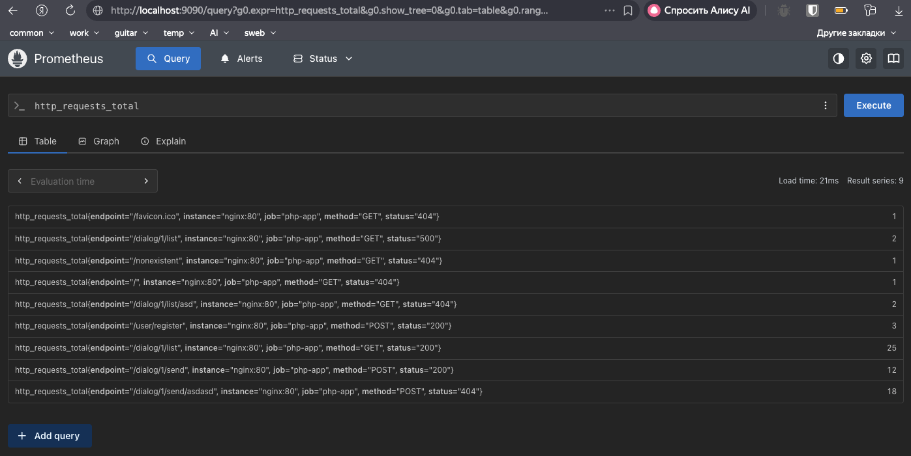
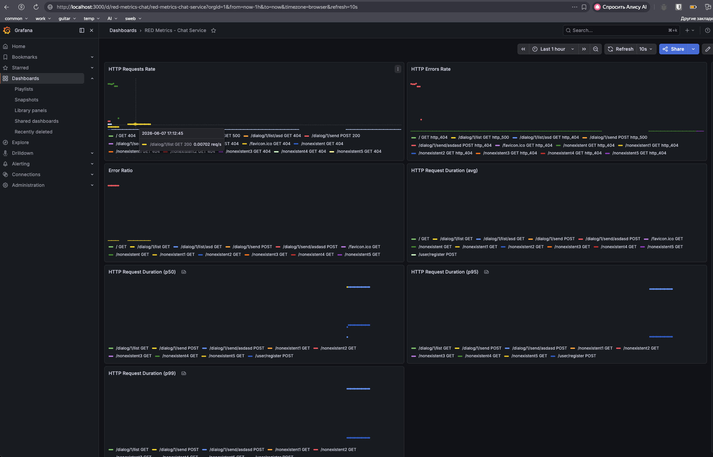
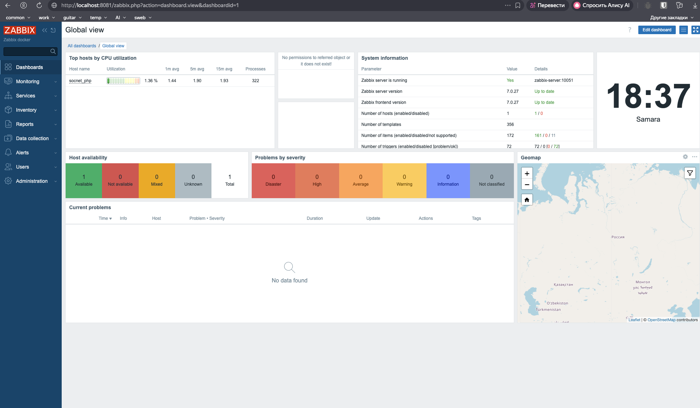

# Мониторинг

Добавлен мониторинг системы с использованием Prometheus, Zabbix и Grafana.

- Zabbix `http://localhost:8081` (логин `Admin`, пароль `zabbix`)
- Prometheus `http://localhost:9090`
- Grafana `http://localhost:3000` (логин `admin`, пароль `admin`).

### Метрики RED
- Создан класс `App\Metrics\PrometheusMetrics` для записи и экспорта метрик в формате Prometheus.
- Метрики хранятся в Redis (используется существующий Redis клиент).
- В роутер приложения добавлен эндпоинт `/metrics` (GET), который возвращает метрики.
- При каждом запросе к API увеличиваются счетчики:
    - `http_requests_total` – общее количество запросов по endpoint, методу и статусу
    - `http_request_duration_seconds_sum`, `http_request_duration_seconds_count`, `http_request_duration_seconds_avg` – сумма, количество и средняя длительность запросов
    - `http_request_duration_seconds_bucket` – гистограмма длительностей для вычисления перцентилей (p50, p95, p99)
    - `http_errors_total` – количество ошибок
- Метрики доступны по адресу `http://localhost:8383/metrics`.

Prometheus




### Дашборд Grafana
- Настроен provisioning для автоматического добавления источника данных (Prometheus) и дашбордов.
- Создан дашборд «RED Metrics - Chat Service» с панелями:
    - HTTP Requests Rate (количество запросов в секунду)
    - HTTP Errors Rate (количество ошибок в секунду)
    - Error Ratio (отношение ошибок к запросам)
    - HTTP Request Duration (avg) – средняя длительность
    - HTTP Request Duration (p50, p95, p99) – перцентили длительности



### Сбор технических метрик через Zabbix
- Zabbix агент настроен на мониторинг контейнера `socnet_php`.
- Агент собирает стандартные системные метрики (CPU, память, диски, сеть).
- Метрики передаются на Zabbix сервер




### Запуск проекта а ```README.md```
