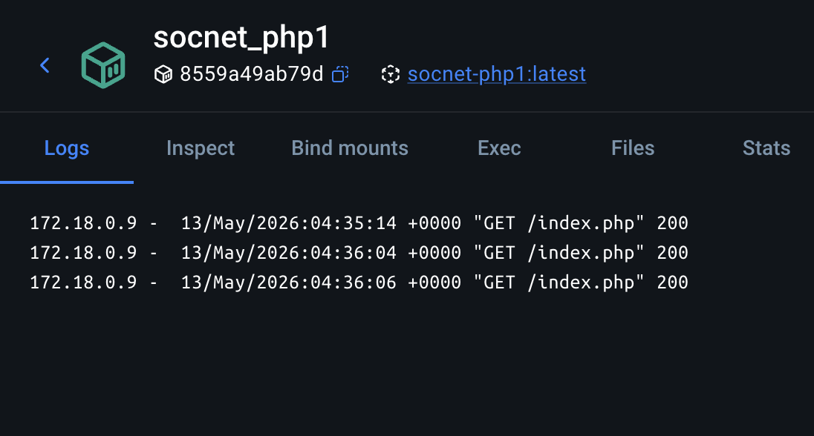
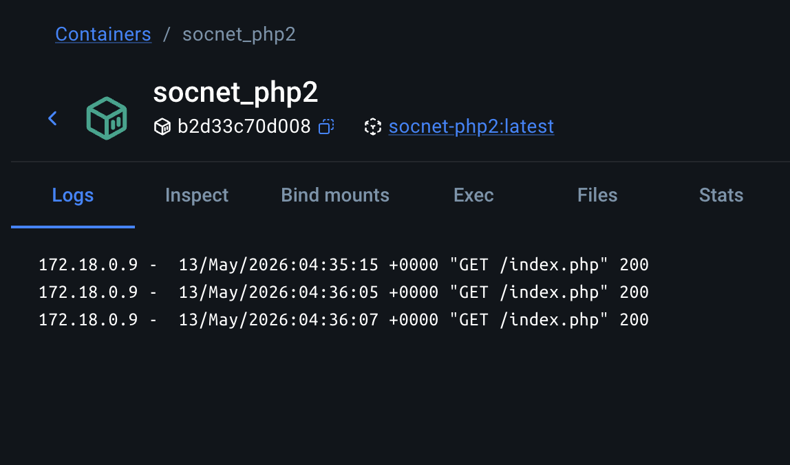
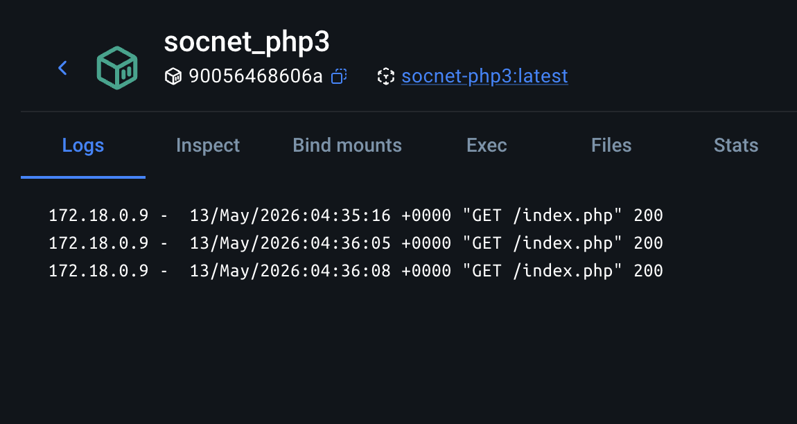
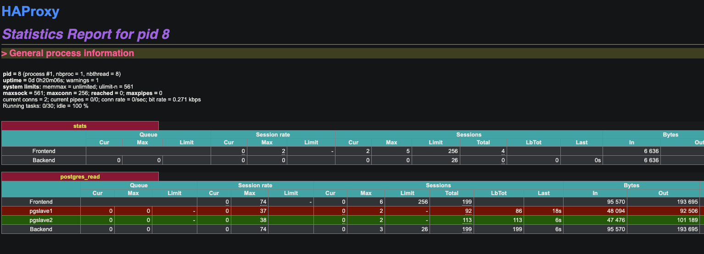
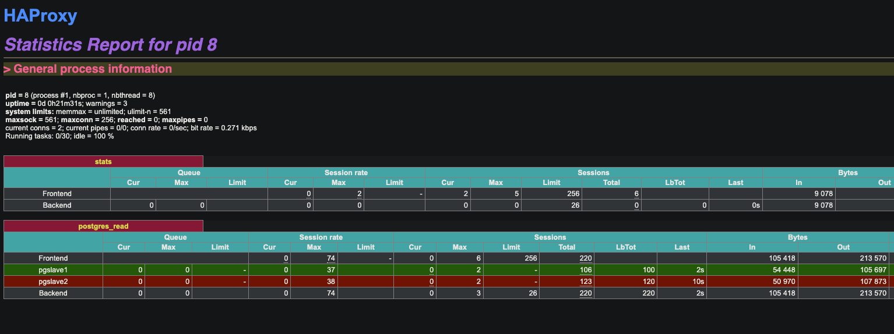

В отчете верно описаны условия эксперимента.
В отчете должны быть логи работы системы.

# Homework 9

## Настроил в проекте балансировку бекенда через `nginx` и балансировку базы данных через `haproxy`

### Конфигурация `haproxy`  `docker/haproxy/haproxy.cfg`

````
global
    daemon
    maxconn 256

defaults
    mode tcp
    timeout connect 5000ms
    timeout client 50000ms
    timeout server 50000ms

listen stats
    mode http
    bind *:1936
    stats enable
    stats uri /
    stats hide-version

listen postgres_read
    bind *:5433
    mode tcp
    balance roundrobin
    option pgsql-check user postgres
    server pgslave1 pgslave1:5432 check
    server pgslave2 pgslave2:5432 check
````

### Конфигурация `nginx` `docker/nginx/default.conf`

````
upstream php_backend {
    server php1:9000;
    server php2:9000;
    server php3:9000;
}

server {
    listen 80;
    index index.php;
    server_name localhost;
    error_log  /var/log/nginx/error.log;
    access_log /var/log/nginx/access.log;
    root /var/www/public;

    location / {
        try_files $uri $uri/ /index.php?$query_string;
    }

    location ~ \.php$ {
        try_files $uri =404;
        fastcgi_split_path_info ^(.+\.php)(/.+)$;
        fastcgi_pass php_backend;
        fastcgi_index index.php;
        include fastcgi_params;
        fastcgi_param SCRIPT_FILENAME $document_root$fastcgi_script_name;
        fastcgi_param PATH_INFO $fastcgi_path_info;
    }

    location ~ /\.ht {
        deny all;
    }
}
````

### Проверка

Запустил проект в докер. `docker-compose.yml`
- 3 контейнера бекенда php1, php2, php3. 
- Мастер базы для записи pgmaster и две реплики pgslave1, pgslave2. 

бекенд
- При запросах к приложению запросы распределяются по ровну между бекендами. 
- При отключении одного или двух бекендов, запросы идут на оставшиеся контейнеры.

- 

- 

- 

БД
- Включил вывод статистики в haproxy
- При запросах к приложению запросы распределяются по ровну между репликами.
- При отключении реплики, запросы идут на активную реплику.

- 
- 
